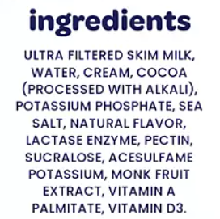
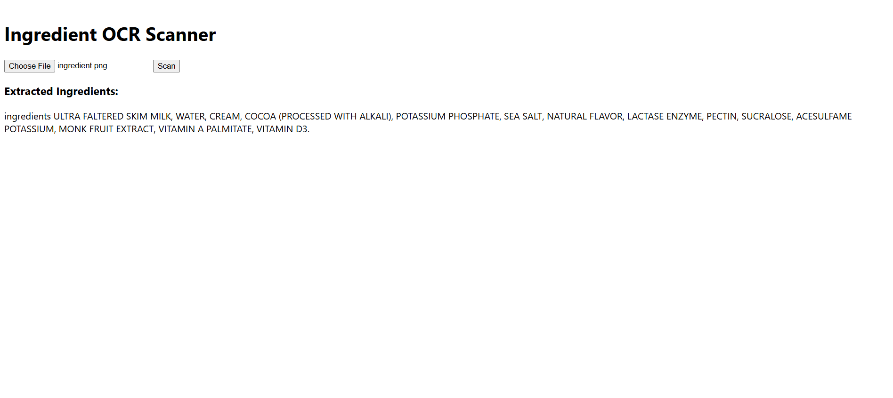

# 🥤 Nutrition OCR App

A full-stack web application that uses Optical Character Recognition (OCR) to extract text from food product ingredient labels — making it easier to identify allergens and dietary information at a glance.

Built with:

- 🔍 **Tesseract OCR** via Python
- 🧠 **Flask** backend for image processing
- ⚛️ **React** frontend for UI and image upload

---

## 📸 Features

- Upload photos or screenshots of ingredient labels
- Extracts ingredient text using OCR (Tesseract)
- Designed for use on nutrition labels, protein shakes, snack bars, etc.
- (Coming soon) Allergen detection and filtering

---

## 🛠️ Tech Stack

| Frontend | Backend                    | OCR Engine          |
| -------- | -------------------------- | ------------------- |
| React    | Flask (Python)             | Tesseract OCR       |
| Axios    | Flask-CORS                 | pytesseract, Pillow |
| HTML/CSS | OpenCV (for preprocessing) |                     |

---

## 🚀 Getting Started

### 1. Clone the Repo

```
git clone https://github.com/anna-rossman/nutrition-ocr-app.git
cd nutrition-ocr
```

### 2. Set Up Backend (Flask + Tesseract)

```
cd server
python -m venv venv
venv\Scripts\activate          # Windows
# or: source venv/bin/activate # Mac/Linux

pip install -r requirements.txt
```

✅ Install Tesseract OCR Engine (Required)

- Windows: [Download here](https://github.com/UB-Mannheim/tesseract/wiki)
- macOS: brew install tesseract
- Linux: sudo apt install tesseract-ocr

### 3. Start the Flask server (backend)

```
python app.py
# Runs on http://localhost:5000
```

### 4. Set up Frontend (React)

```
cd ../client
npm install
npm start
# Runs on http://localhost:3000
```

## 📂 Folder Structure

```
Copy
Edit
nutrition-ocr/
├── client/      # React frontend
├── server/      # Flask + OCR backend
├── README.md
```

## 🧪 Example Input

Image: Photo or screenshot of ingredient list



Output:



## 🧱 Coming Soon

⚠️ Input allergens/intolerances and highlight them

📱 Mobile responsiveness

🧠 Spell correction for OCR errors (faltered → filtered)

🛠️ Improve OCR output (e.g. ingredients list from a bottle, poor quality photos)

## 🙋‍♀️ Author

Built with love for nutrition + tech by @anna-rossman
